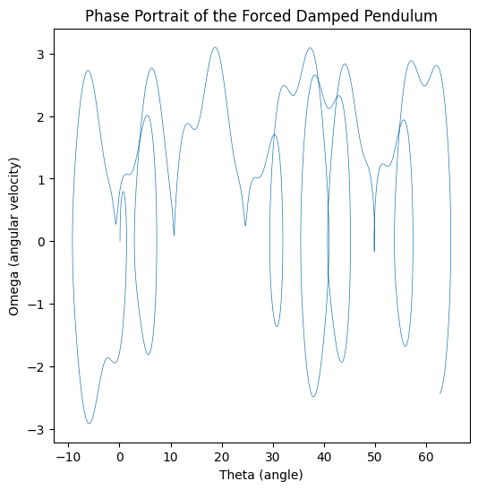

import numpy as np
import matplotlib.pyplot as plt

def projectile_range(v0, theta, g=9.81):
"""
Computes the range of a projectile given initial velocity and launch angle.

    Parameters:
    v0 : float
        Initial velocity (m/s)
    theta : float
        Launch angle (degrees)
    g : float, optional
        Acceleration due to gravity (default is 9.81 m/s^2)

    Returns:
    float
        Range of the projectile (m)
    """
    theta_rad = np.radians(theta)
    return (v0 ** 2 * np.sin(2 * theta_rad)) / g

# Define parameters

v0 = 20 # Initial velocity in m/s
theta_values = np.linspace(0, 90, 100) # Angles from 0 to 90 degrees
ranges = [projectile_range(v0, theta) for theta in theta_values]

# Plot the results

plt.figure(figsize=(8, 5))
plt.plot(theta_values, ranges, label=f'Initial Velocity = {v0} m/s')
plt.xlabel('Launch Angle (degrees)')
plt.ylabel('Range (m)')
plt.title('Projectile Range as a Function of Launch Angle')
plt.legend()
plt.grid()
plt.show()

