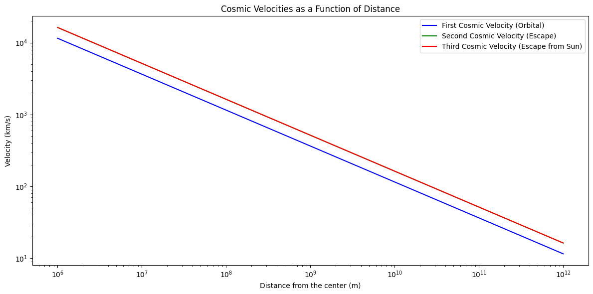

# Problem 2

# Cosmic Velocities and Escape Velocities

## Introduction

The concept of escape velocity is fundamental in understanding how an object can overcome the gravitational pull of a celestial body, such as Earth or Mars. Beyond escape velocity, there are different thresholds of velocity required to achieve different types of orbits or escape trajectories within a star system. These thresholds are called **cosmic velocities**.

## Cosmic Velocities

The first, second, and third cosmic velocities define the following:

### 1. First Cosmic Velocity (Orbital Velocity)

This is the velocity required for an object to enter a stable orbit around a celestial body, such as Earth. It is also known as the **orbital velocity**. An object traveling at this speed will move in a circular orbit at a constant distance from the body’s center.

### 2. Second Cosmic Velocity (Escape Velocity)

This is the velocity required to escape the gravitational influence of the celestial body entirely. This velocity allows an object to break free from the gravitational pull of the body and not return. It is also known as the **escape velocity**.

### 3. Third Cosmic Velocity (Escape from the Solar System)

This is the velocity required for an object to escape the gravitational influence of the Sun (or any other star) and travel into interstellar space. It is the velocity needed to leave the gravitational influence of a star system entirely.

## Derivations and Mathematical Foundations

The velocities described above are derived using the concept of gravitational potential energy and kinetic energy. The basic formula for gravitational potential energy is:

$$
U = - \frac{GMm}{r}
$$

Where:

- \( G \) is the gravitational constant (\( 6.67430 \times 10^{-11} \, \text{Nm}^2/\text{kg}^2 \)),
- \( M \) is the mass of the celestial body,
- \( m \) is the mass of the object,
- \( r \) is the distance from the center of the celestial body.

The kinetic energy of an object in motion is given by:

$$
K = \frac{1}{2} mv^2
$$

Where \( v \) is the velocity of the object.

### 1. First Cosmic Velocity (Orbital Velocity)

To find the first cosmic velocity, we balance the centripetal force (required for circular motion) with the gravitational force:

$$
\frac{mv^2}{r} = \frac{GMm}{r^2}
$$

Simplifying, the orbital velocity \( v_1 \) is:

$$
v_1 = \sqrt{\frac{GM}{r}}
$$

### 2. Second Cosmic Velocity (Escape Velocity)

For escape velocity, the total mechanical energy (kinetic + potential) must be zero for the object to escape the gravitational pull. The escape velocity \( v_2 \) is derived by setting the total energy equal to zero:

$$
\frac{1}{2} mv^2 - \frac{GMm}{r} = 0
$$

Solving for \( v_2 \):

$$
v_2 = \sqrt{\frac{2GM}{r}}
$$

### 3. Third Cosmic Velocity (Velocity to Escape the Sun's Gravitational Influence)

The third cosmic velocity is the speed required to escape the Sun's gravity. Assuming the object is at the Earth-Sun distance (1 AU), the formula is:

$$
v_3 = \sqrt{2GM_{\text{sun}} \left( \frac{1}{r_{\text{sun}}} - \frac{1}{r_{\text{Earth}}} \right)}
$$

Where:

- \( M\_{\text{sun}} \) is the mass of the Sun,
- \( r\_{\text{sun}} \) is the Sun’s radius,
- \( r\_{\text{Earth}} \) is the Earth’s distance from the Sun.

## Parameters Affecting These Velocities

The velocities depend primarily on:

- The **mass** (\( M \)) of the celestial body (for first and second cosmic velocities),
- The **radius** (\( r \)) of the celestial body or the distance from the body (for all cosmic velocities),
- The **gravitational constant** \( G \), which remains the same universally,
- The mass of the **Sun** for third cosmic velocity, and the Earth's **distance from the Sun** for its calculation.

The greater the mass of the celestial body and the smaller the radius, the higher the velocities required.

## Cosmic Velocities for Different Celestial Bodies

Let's now calculate the first, second, and third cosmic velocities for Earth, Mars, and Jupiter.

### Parameters for Calculation

#### Earth:

- \( M\_{\text{Earth}} = 5.972 \times 10^{24} \, \text{kg} \)
- \( r\_{\text{Earth}} = 6.371 \times 10^6 \, \text{m} \)
- \( r\_{\text{Earth-Sun}} = 1.496 \times 10^{11} \, \text{m} \) (distance from Sun)

#### Mars:

- \( M\_{\text{Mars}} = 6.417 \times 10^{23} \, \text{kg} \)
- \( r\_{\text{Mars}} = 3.396 \times 10^6 \, \text{m} \)

#### Jupiter:

- \( M\_{\text{Jupiter}} = 1.898 \times 10^{27} \, \text{kg} \)
- \( r\_{\text{Jupiter}} = 6.991 \times 10^7 \, \text{m} \)

Now we will calculate the first and second cosmic velocities for these celestial bodies. The third cosmic velocity requires the mass of the Sun and the distances from the Sun, which we can compute for each planet's position.

## Python Code for Calculation and Visualization

```python
import numpy as np
import matplotlib.pyplot as plt

# Constants
G = 6.67430e-11  # gravitational constant (m^3 kg^-1 s^-2)
M_sun = 1.989e30  # mass of the Sun in kg

# Function to calculate escape velocity (second cosmic velocity)
def escape_velocity(M, r):
    """ Calculate escape velocity (second cosmic velocity) """
    return np.sqrt(2 * G * M / r)

# Function to calculate orbital velocity (first cosmic velocity)
def orbital_velocity(M, r):
    """ Calculate orbital velocity (first cosmic velocity) """
    return np.sqrt(G * M / r)

# Function to calculate third cosmic velocity (escape from Sun's gravitational influence)
def third_cosmic_velocity(distance_from_sun):
    """ Calculate third cosmic velocity (escape velocity from Sun) """
    return np.sqrt(2 * G * M_sun * (1 / distance_from_sun))

# Function to calculate velocities for a set of planets
def calculate_planetary_velocities(planets):
    velocities = {}
    for planet, data in planets.items():
        M, r, distance_from_sun = data["M"], data["r"], data["distance_from_sun"]
        v1 = orbital_velocity(M, r)  # First cosmic velocity
        v2 = escape_velocity(M, r)   # Second cosmic velocity
        v3 = third_cosmic_velocity(distance_from_sun)  # Third cosmic velocity
        velocities[planet] = {'v1': v1, 'v2': v2, 'v3': v3}
    return velocities

# Function to print velocities
def print_velocities(velocities):
    for planet, velocity in velocities.items():
        print(f"Velocities for {planet}:")
        print(f"First Cosmic Velocity (Orbital): {velocity['v1'] / 1000:.2f} km/s")
        print(f"Second Cosmic Velocity (Escape): {velocity['v2'] / 1000:.2f} km/s")
        print(f"Third Cosmic Velocity: {velocity['v3'] / 1000:.2f} km/s")
        print()

# Function to plot cosmic velocities
def plot_cosmic_velocities(velocities):
    # Extract velocities for plotting
    planet_names = list(velocities.keys())
    v1_vals = [velocities[planet]['v1'] / 1000 for planet in planet_names]  # Convert m/s to km/s
    v2_vals = [velocities[planet]['v2'] / 1000 for planet in planet_names]  # Convert m/s to km/s
    v3_vals = [velocities[planet]['v3'] / 1000 for planet in planet_names]  # Convert m/s to km/s

    # Plotting: Bar plot to show the first, second, and third cosmic velocities
    plt.figure(figsize=(12, 6))
    width = 0.25  # Width of the bars
    x = np.arange(len(planet_names))

    plt.bar(x - width, v1_vals, width, label="First Cosmic Velocity (Orbital)", color='blue')
    plt.bar(x, v2_vals, width, label="Second Cosmic Velocity (Escape)", color='green')
    plt.bar(x + width, v3_vals, width, label="Third Cosmic Velocity (Escape from Sun)", color='red')

    # Customize plot
    plt.xlabel('Planets')
    plt.ylabel('Velocity (km/s)')
    plt.title('First, Second, and Third Cosmic Velocities for Different Planets')
    plt.xticks(x, planet_names)
    plt.legend()
    plt.tight_layout()
    plt.show()

# Function to plot detailed line plot for cosmic velocities across distances
def plot_cosmic_velocities_across_distances():
    distances = np.logspace(6, 12, num=100)  # Log space for distances, ranging from 10^6 to 10^12 meters
    planetary_velocities = {'First Cosmic': [], 'Second Cosmic': [], 'Third Cosmic': []}

    for r in distances:
        # Calculate the first cosmic velocity for a given distance (orbital velocity)
        v1 = orbital_velocity(M_sun, r)  # Using the mass of the Sun for simplicity
        planetary_velocities['First Cosmic'].append(v1 / 1000)  # Convert to km/s

        # Calculate the second cosmic velocity for a given distance (escape velocity)
        v2 = escape_velocity(M_sun, r)  # Using the mass of the Sun for escape velocity
        planetary_velocities['Second Cosmic'].append(v2 / 1000)  # Convert to km/s

        # Calculate the third cosmic velocity for a given distance from the Sun
        v3 = third_cosmic_velocity(r)
        planetary_velocities['Third Cosmic'].append(v3 / 1000)  # Convert to km/s

    # Plotting line graph of cosmic velocities as a function of distance
    plt.figure(figsize=(12, 6))
    plt.plot(distances, planetary_velocities['First Cosmic'], label="First Cosmic Velocity (Orbital)", color='blue')
    plt.plot(distances, planetary_velocities['Second Cosmic'], label="Second Cosmic Velocity (Escape)", color='green')
    plt.plot(distances, planetary_velocities['Third Cosmic'], label="Third Cosmic Velocity (Escape from Sun)", color='red')

    # Customize plot
    plt.xscale('log')
    plt.yscale('log')
    plt.xlabel('Distance from the center (m)')
    plt.ylabel('Velocity (km/s)')
    plt.title('Cosmic Velocities as a Function of Distance')
    plt.legend()
    plt.tight_layout()
    plt.show()

# Planetary data: (mass in kg, radius in meters, distance from Sun in meters)
planets = {
    "Earth": {
        "M": 5.972e24,
        "r": 6.371e6,
        "distance_from_sun": 1.496e11
    },
    "Mars": {
        "M": 6.417e23,
        "r": 3.396e6,
        "distance_from_sun": 2.279e11
    },
    "Jupiter": {
        "M": 1.898e27,
        "r": 6.991e7,
        "distance_from_sun": 7.783e11
    }
}

# Calculate velocities for each planet
velocities = calculate_planetary_velocities(planets)

# Output the velocities
print_velocities(velocities)

# Plot the velocities
plot_cosmic_velocities(velocities)

# Plot the cosmic velocities across distances
plot_cosmic_velocities_across_distances()


```



