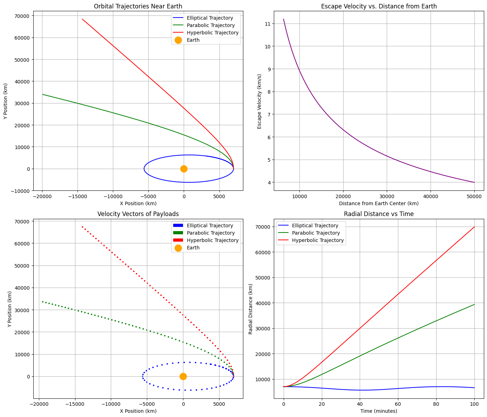

# Problem 3

# 1. Introduction to Trajectories Near Earth

When a payload is released near Earth from a moving rocket, its trajectory depends on several factors:

- **Initial Position**: The starting point of the payload relative to Earth.
- **Initial Velocity**: The speed and direction of the payload when released.
- **Gravitational Forces**: The Earth’s gravitational field acting on the payload.
- **Orbital Mechanics Principles**: Newton’s Law of Gravitation, Kepler’s Laws, and the concepts of escape velocity and orbital insertion.

# 2. Orbital Mechanics Fundamentals

## Gravitational Force

According to Newton's Law of Gravitation:

$$
F = \frac{GMm}{r^2}
$$

Where:

- \( F \) is the gravitational force.
- \( G \) is the gravitational constant.
- \( M \) is the mass of Earth.
- \( m \) is the mass of the payload.
- \( r \) is the distance between the center of the Earth and the payload.

## Equations of Motion

The motion of the payload is governed by Newton's second law, where the gravitational force provides the acceleration:

$$
F = ma = \frac{GMm}{r^2} \hat{r}
$$

This leads to the second-order differential equations that describe the position and velocity of the payload over time. These equations are usually solved numerically because they involve non-linear terms due to the \( r^2 \) dependence in the gravitational force.

## Escape Velocity

The escape velocity is the minimum speed needed for an object to escape Earth's gravitational field, and it can be computed using:

$$
v_e = \sqrt{\frac{2GM}{r}}
$$

Where:

- \( v_e \) is the escape velocity.
- \( r \) is the distance from the center of Earth.

## Orbital Types

Based on the velocity of the object relative to Earth's gravity, the trajectory can be:

- **Elliptical**: If the object's velocity is less than the escape velocity.
- **Parabolic**: If the velocity is exactly equal to the escape velocity.
- **Hyperbolic**: If the object's velocity is greater than the escape velocity.

# 3. Numerical Simulation Approach

We’ll use Python to implement the simulation. The goal is to numerically solve the equations of motion for a payload under Earth’s gravitational field.

## 3.1 Initial Setup

We'll assume the following initial conditions for simplicity:

- **Initial position** \( r_0 = (x_0, y_0, z_0) \).
- **Initial velocity** \( v_0 = (v_x, v_y, v_z) \).
- **Earth's gravitational constant** \( G = 6.67430 \times 10^{-11} \, \text{m}^3 \text{kg}^{-1} \text{s}^{-2} \).
- **Earth's mass** \( M = 5.972 \times 10^{24} \, \text{kg} \).
- **Earth's radius** \( R = 6371 \, \text{km} \).

## 3.2 Solving the Equations of Motion

We’ll solve the following system of equations numerically:

$$
r''(t) = -\frac{GM}{|r(t)|^3} r(t)
$$

This requires discretizing time and numerically solving for the position and velocity at each timestep using a numerical integrator like Runge-Kutta or Euler's method.

## 3.3 Visualization

We will visualize the trajectory using matplotlib in Python, creating plots that show the path of the payload, its velocity vector, and the Earth’s gravitational influence.

# 4. Python Code Implementation

```python
import numpy as np
import matplotlib.pyplot as plt

# Constants
G = 6.67430e-11  # Gravitational constant (m^3 kg^-1 s^-2)
M = 5.972e24      # Mass of Earth (kg)
R = 6371e3        # Radius of Earth (m)

# Function to compute the gravitational force and acceleration
def gravitational_acceleration(r):
    r_magnitude = np.linalg.norm(r)
    return -G * M * r / r_magnitude**3

# Function to compute escape velocity at a given distance from Earth's center
def escape_velocity(r):
    return np.sqrt(2 * G * M / r)

# Initial conditions (different cases for initial velocity)
initial_conditions = [
    (np.array([7000e3, 0, 0]), np.array([0, 7.12e3, 0])),  # Elliptical (less than escape velocity)
    (np.array([7000e3, 0, 0]), np.array([0, 11.2e3, 0])),  # Parabolic (exactly escape velocity)
    (np.array([7000e3, 0, 0]), np.array([0, 15e3, 0])),     # Hyperbolic (greater than escape velocity)
]

# Time parameters
t_max = 6000  # Maximum time (s)
dt = 1        # Time step (s)
times = np.arange(0, t_max, dt)

# Plot setup
fig, ax = plt.subplots(2, 2, figsize=(14, 12))

# Initialize plot styles
colors = ['blue', 'green', 'red']
labels = ['Elliptical Trajectory', 'Parabolic Trajectory', 'Hyperbolic Trajectory']

# Loop over different initial conditions to simulate trajectories
for i, (r0, v0) in enumerate(initial_conditions):
    # Initialize arrays to store results
    positions = np.zeros((len(times), 3))
    velocities = np.zeros((len(times), 3))

    # Set initial conditions
    positions[0] = r0
    velocities[0] = v0

    # Numerical integration (Euler's method)
    for j in range(1, len(times)):
        a = gravitational_acceleration(positions[j-1])  # acceleration due to gravity
        velocities[j] = velocities[j-1] + a * dt        # update velocity
        positions[j] = positions[j-1] + velocities[j] * dt  # update position

    # Plot trajectory in the first subplot (showing different types)
    ax[0, 0].plot(positions[:, 0] / 1000, positions[:, 1] / 1000, label=labels[i], color=colors[i])

# Add labels and Earth marker
ax[0, 0].scatter(0, 0, color='orange', s=200, label='Earth', zorder=10)
ax[0, 0].set_title('Orbital Trajectories Near Earth')
ax[0, 0].set_xlabel('X Position (km)')
ax[0, 0].set_ylabel('Y Position (km)')
ax[0, 0].grid(True)
ax[0, 0].legend()

# Plot escape velocity as a function of distance from Earth's center (second subplot)
r_vals = np.linspace(R, 5e7, 100)  # from Earth's surface to 50,000 km away
v_escape = escape_velocity(r_vals)
ax[0, 1].plot(r_vals / 1000, v_escape / 1000, color='purple')
ax[0, 1].set_title('Escape Velocity vs. Distance from Earth')
ax[0, 1].set_xlabel('Distance from Earth Center (km)')
ax[0, 1].set_ylabel('Escape Velocity (km/s)')
ax[0, 1].grid(True)

# Plot the velocity vectors for different positions (third subplot)
for i, (r0, v0) in enumerate(initial_conditions):
    positions = np.zeros((len(times), 3))
    velocities = np.zeros((len(times), 3))

    # Set initial conditions
    positions[0] = r0
    velocities[0] = v0

    # Numerical integration (Euler's method)
    for j in range(1, len(times)):
        a = gravitational_acceleration(positions[j-1])  # acceleration due to gravity
        velocities[j] = velocities[j-1] + a * dt        # update velocity
        positions[j] = positions[j-1] + velocities[j] * dt  # update position

    # Plot velocity vectors
    ax[1, 0].quiver(positions[::100, 0] / 1000, positions[::100, 1] / 1000, velocities[::100, 0] / 1000, velocities[::100, 1] / 1000, angles='xy', scale_units='xy', scale=0.1, color=colors[i], label=labels[i])

ax[1, 0].scatter(0, 0, color='orange', s=200, label='Earth', zorder=10)
ax[1, 0].set_title('Velocity Vectors of Payloads')
ax[1, 0].set_xlabel('X Position (km)')
ax[1, 0].set_ylabel('Y Position (km)')
ax[1, 0].legend()
ax[1, 0].grid(True)

# Plot position vs time for all three scenarios (fourth subplot)
for i, (r0, v0) in enumerate(initial_conditions):
    positions = np.zeros((len(times), 3))
    velocities = np.zeros((len(times), 3))

    # Set initial conditions
    positions[0] = r0
    velocities[0] = v0

    # Numerical integration (Euler's method)
    for j in range(1, len(times)):
        a = gravitational_acceleration(positions[j-1])  # acceleration due to gravity
        velocities[j] = velocities[j-1] + a * dt        # update velocity
        positions[j] = positions[j-1] + velocities[j] * dt  # update position

    # Plot position vs time (radial distance)
    radial_distance = np.linalg.norm(positions, axis=1) / 1000  # in km
    ax[1, 1].plot(times / 60, radial_distance, label=labels[i], color=colors[i])

ax[1, 1].set_title('Radial Distance vs Time')
ax[1, 1].set_xlabel('Time (minutes)')
ax[1, 1].set_ylabel('Radial Distance (km)')
ax[1, 1].legend()
ax[1, 1].grid(True)

plt.tight_layout()
plt.show()

```


