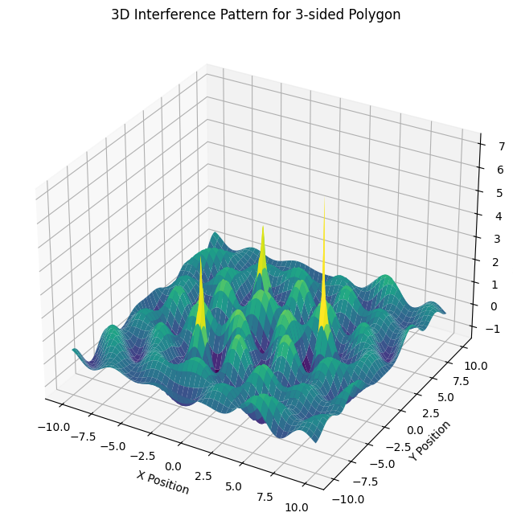
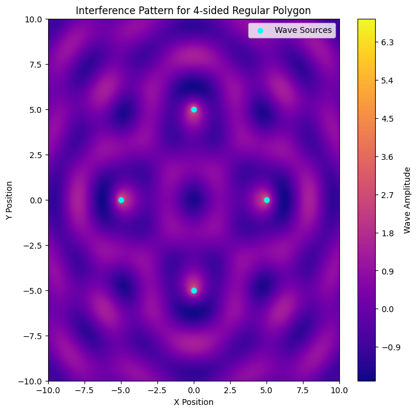
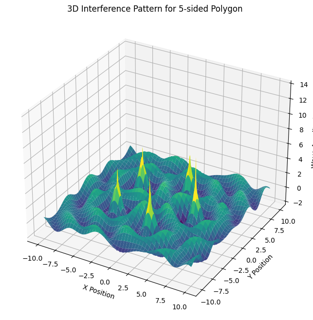

# Problem 1

# Wave Interference from Multiple Sources

### 1. Wave Equation for a Single Point Source

A single point source at position \( (x_0, y_0) \) emits a circular wave described by:

$$
\eta(x, y, t) = \frac{A}{r} \cos(k r - \omega t + \phi)
$$

where:

- \( A \) is the amplitude of the wave.
- \( k = \frac{2\pi}{\lambda} \) is the wave number, related to the wavelength \( \lambda \).
- \( \omega = 2\pi f \) is the angular frequency, where \( f \) is the frequency.
- \( r = \sqrt{(x - x_0)^2 + (y - y_0)^2} \) is the distance from the source to a given point \( (x, y) \).
- \( \phi \) is the initial phase.

This equation represents a water surface disturbance that propagates outward in circular waves, decreasing in amplitude with distance \( \left(\frac{1}{r}\right) \) due to energy spreading.

---

### 2. Superposition of Waves from Multiple Sources

When multiple point sources exist, the total displacement at a point \( (x, y) \) is the sum of all individual wave contributions:

$$
\eta_{\text{sum}}(x, y, t) = \sum_{i=1}^{N} \frac{A}{r_i} \cos(k r_i - \omega t + \phi_i)
$$

where:

- \( N \) is the number of wave sources.
- \( r_i = \sqrt{(x - x_i)^2 + (y - y_i)^2} \) is the distance from the \( i \)-th source to the point \( (x, y) \).

Each wave contributes to the overall displacement at \( (x, y) \), and depending on their phase relationships, interference occurs.

---

### 3. Positioning of Wave Sources on a Regular Polygon

To analyze interference patterns, we position wave sources at the vertices of a regular polygon centered at the origin. The coordinates of each vertex are:

$$
x_i = R \cos\left( \frac{2\pi i}{N} \right), \quad y_i = R \sin\left( \frac{2\pi i}{N} \right)
$$

where:

- \( R \) is the radius (distance from the center to a vertex).
- \( i = 0, 1, 2, \dots, N-1 \) (index of each vertex).
- \( N \) is the number of vertices (sides of the polygon).

For example:

- **Triangle (N = 3)**: Three wave sources positioned at \( 120^\circ \) intervals.
- **Square (N = 4)**: Four sources positioned at \( 90^\circ \) intervals.
- **Pentagon (N = 5)**: Five sources at \( 72^\circ \) intervals, and so on.

---

### 4. Understanding Interference Patterns

When multiple sources emit waves simultaneously, they interact in specific ways:

#### (a) Constructive Interference (Amplification)

Occurs when waves meet in phase, reinforcing each other. This happens at points where:

$$
k r_i - \omega t + \phi_i = 2\pi m, \quad m \in \mathbb{Z}
$$

These regions appear as **bright** or high-amplitude areas in a graphical representation.

#### (b) Destructive Interference (Cancellation)

Occurs when waves meet out of phase, canceling each other. This happens when:

$$
k r_i - \omega t + \phi_i = (2m + 1)\pi, \quad m \in \mathbb{Z}
$$

These regions appear as **dark** or low-amplitude areas.

#### (c) Interference Patterns Based on Polygon Type

Each polygon has a unique interference pattern due to differences in source placement:

- **Equilateral Triangle (N=3)**: The pattern forms a **six-fold symmetry** with alternating constructive and destructive regions. Interference creates concentric and radial symmetry around the center.
- **Square (N=4)**: The waves form a **checkerboard-like pattern** with alternating constructive/destructive zones. High symmetry along the diagonal and central axes.
- **Pentagon (N=5)**: More complex interference with **star-like patterns** emerging. Interference fringes appear denser near the center.
- **Higher N (e.g., Hexagon, Octagon)**: More sources lead to denser, intricate patterns. Constructive regions form **spiral-like** or **web-like structures**.

---

### 5. Observing Interference Patterns Graphically

By evaluating \( \eta\_{\text{sum}}(x, y, t) \) over a grid of \( (x, y) \) points and plotting it as a contour map, we can visualize the interference pattern. In these plots:

- **Bright areas** indicate constructive interference.
- **Dark areas** indicate destructive interference.

This graphical approach helps in understanding:

- How waves reinforce or cancel out.
- The role of phase differences in pattern formation.
- The impact of increasing the number of sources.

---

### Conclusion

Interference patterns arise due to the superposition of waves from multiple sources. Different regular polygons produce distinctive and symmetrical patterns. Constructive interference creates **bright regions** (high amplitude), while destructive interference results in **dark regions** (low amplitude). By analyzing these patterns, we gain insight into wave physics, coherence, and superposition principles.

```python

import numpy as np
import matplotlib.pyplot as plt
from mpl_toolkits.mplot3d import Axes3D
import matplotlib.animation as animation

def wave_interference_polygon(sides=3, radius=5, A=1, k=2, w=2*np.pi, resolution=500, time=0):
    """
    Simulates wave interference from sources placed at the vertices of a regular polygon.

    Parameters:
    - sides: Number of sides of the regular polygon
    - radius: Distance from the center to each vertex
    - A: Amplitude of the waves
    - k: Wave number (related to wavelength)
    - w: Angular frequency
    - resolution: Grid resolution for visualization
    - time: Time instance for animation purposes
    """
    # Define spatial domain
    x = np.linspace(-radius*2, radius*2, resolution)
    y = np.linspace(-radius*2, radius*2, resolution)
    X, Y = np.meshgrid(x, y)

    # Compute source positions (polygon vertices)
    angles = np.linspace(0, 2*np.pi, sides, endpoint=False)
    sources = [(radius * np.cos(a), radius * np.sin(a)) for a in angles]

    # Superpose waves from all sources
    eta_sum = np.zeros_like(X)
    for (x0, y0) in sources:
        r = np.sqrt((X - x0)**2 + (Y - y0)**2)
        eta_sum += A * np.cos(k * r - w * time) / np.sqrt(r + 1e-6)  # Small value avoids division by zero

    # 2D Contour Plot
    plt.figure(figsize=(8, 8))
    plt.contourf(X, Y, eta_sum, levels=200, cmap='plasma')
    plt.colorbar(label='Wave Amplitude')
    plt.scatter(*zip(*sources), color='cyan', marker='o', label='Wave Sources')
    plt.legend()
    plt.title(f'Interference Pattern for {sides}-sided Regular Polygon')
    plt.xlabel('X Position')
    plt.ylabel('Y Position')
    plt.show()

    # 3D Surface Plot
    fig = plt.figure(figsize=(10, 8))
    ax = fig.add_subplot(111, projection='3d')
    ax.plot_surface(X, Y, eta_sum, cmap='viridis', edgecolor='none')
    ax.set_title(f'3D Interference Pattern for {sides}-sided Polygon')
    ax.set_xlabel('X Position')
    ax.set_ylabel('Y Position')
    ax.set_zlabel('Wave Amplitude')
    plt.show()

def animate_wave_interference(sides=3, frames=60):
    """Creates an animated interference pattern."""
    fig, ax = plt.subplots(figsize=(8, 8))

    def update(frame):
        ax.clear()
        x = np.linspace(-10, 10, 500)
        y = np.linspace(-10, 10, 500)
        X, Y = np.meshgrid(x, y)
        angles = np.linspace(0, 2*np.pi, sides, endpoint=False)
        sources = [(5 * np.cos(a), 5 * np.sin(a)) for a in angles]

        eta_sum = np.zeros_like(X)
        for (x0, y0) in sources:
            r = np.sqrt((X - x0)**2 + (Y - y0)**2)
            eta_sum += np.cos(2 * r - 2*np.pi * frame / frames) / np.sqrt(r + 1e-6)

        ax.contourf(X, Y, eta_sum, levels=100, cmap='plasma')
        ax.scatter(*zip(*sources), color='white', marker='o')
        ax.set_title(f'Wave Interference Animation (Frame {frame})')

    ani = animation.FuncAnimation(fig, update, frames=frames, interval=100)
    plt.show()

# Example usage: Generate impressive interference patterns
wave_interference_polygon(sides=3)
wave_interference_polygon(sides=4)
wave_interference_polygon(sides=5)

# Run animation (uncomment below to see it)
# animate_wave_interference(sides=4)


```







