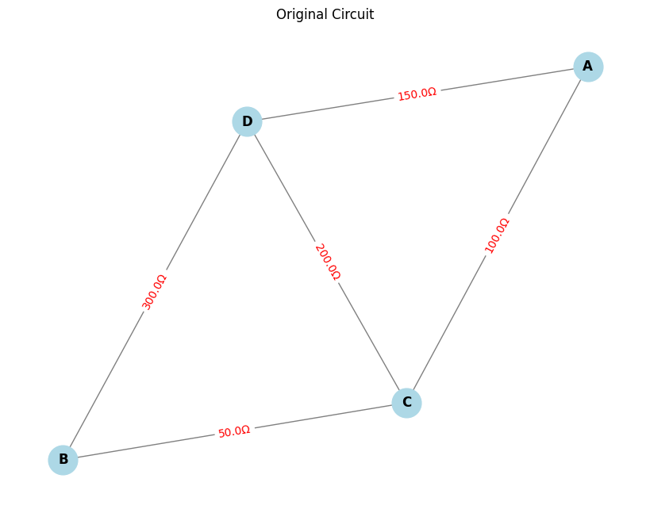

# Problem 1

# Equivalent Resistance Using Graph Theory

## Task 1: Simplified Algorithm Description

### Introduction

Calculating the equivalent resistance of a circuit is fundamental in electrical engineering. While traditional methods involve iteratively applying series and parallel resistor rules, these approaches can become cumbersome for complex circuits with many components. Graph theory offers a more systematic and algorithmic approach to solving this problem.

In this approach:

- **Nodes** represent junctions in the circuit.
- **Edges** represent resistors, with the resistance values as the weights of the edges.

This document describes the algorithm for calculating the equivalent resistance of a circuit using graph theory.

---

### Key Concepts for the Algorithm

#### Series Connection:

- **Series connection**: Resistors are connected end-to-end, and the total resistance is the sum of individual resistances.

  Formula for series resistors:

  $$
  R_{eq} = R_1 + R_2 + \cdots + R_n
  $$

  Example: For two resistors \( R_1 = 6 \, \Omega \) and \( R_2 = 3 \, \Omega \) in series:

  $$
  R_{eq} = R_1 + R_2 = 6 + 3 = 9 \, \Omega
  $$

#### Parallel Connection:

- **Parallel connection**: Resistors have both terminals connected to the same pair of nodes, and the total resistance is found using the parallel resistance formula.

  Formula for parallel resistors:

  $$
  \frac{1}{R_{eq}} = \frac{1}{R_1} + \frac{1}{R_2} + \cdots + \frac{1}{R_n}
  $$

  Example: For two resistors \( R_1 = 6 \, \Omega \) and \( R_2 = 3 \, \Omega \) in parallel:

  $$
  \frac{1}{R_{eq}} = \frac{1}{R_1} + \frac{1}{R_2} = \frac{1}{6} + \frac{1}{3} = \frac{1}{R_{eq}} = \frac{1}{2}
  $$

  Thus, the equivalent resistance is:

  $$
  R_{eq} = 2 \, \Omega
  $$

---

### Algorithm Description

The algorithm simplifies the circuit by **iteratively reducing the graph**. This reduction involves identifying series and parallel connections and simplifying them step by step until only one node remains, representing the total equivalent resistance.

#### Step 1: Represent the Circuit as a Graph

- **Nodes**: Each junction in the circuit is represented by a node in the graph.
- **Edges**: Each resistor is represented as an edge between two nodes, with the resistance as the weight of the edge.

Example:

- Two resistors \( R_1 = 6 \, \Omega \) and \( R_2 = 3 \, \Omega \) in series:
  - \( R_1 \) is connected to node 1, and \( R_2 \) is connected between node 2 and node 3.
- The graph representation has three nodes (1, 2, and 3) and two edges representing \( R_1 \) and \( R_2 \).

#### Step 2: Detect Series and Parallel Connections

We will iteratively reduce the graph by simplifying the series and parallel connections.

##### Series Connections:

- If two resistors are in series (i.e., connected end-to-end), combine them by adding their resistance values.

  For two resistors \( R_1 \) and \( R_2 \) in series, the equivalent resistance is:

  $$
  R_{eq} = R_1 + R_2
  $$

  This process is repeated until no more simple series connections are left.

##### Parallel Connections:

- If two resistors are in parallel (i.e., connected between the same two nodes), combine them using the parallel formula.

  For two resistors \( R_1 \) and \( R_2 \) in parallel, the equivalent resistance is:

  $$
  \frac{1}{R_{eq}} = \frac{1}{R_1} + \frac{1}{R_2}
  $$

  This process is repeated until no more simple parallel connections are left.

#### Step 3: Iterative Graph Reduction

After identifying and simplifying the series and parallel connections, the graph is reduced step-by-step:

1. **Identify series connections**: Traverse the graph and check for resistors that are connected in series. Once identified, combine them by adding their resistance values.
2. **Identify parallel connections**: Similarly, check for resistors that are connected in parallel. Combine them using the parallel resistance formula.
3. **Repeat the process**: After each reduction (whether series or parallel), the graph is updated. New series or parallel connections may emerge from the simplification, so the process is repeated until the graph is reduced to a single equivalent resistance.

#### Step 4: Final Simplification

- The algorithm continues simplifying the circuit until only **one node** remains, and the resistance of this node is the equivalent resistance of the entire circuit.

---

### Pseudocode for the Algorithm

```plaintext
Algorithm: Calculate Equivalent Resistance Using Graph Theory

Input: Graph G with nodes representing junctions and edges representing resistors
Output: Equivalent resistance of the entire circuit

1. Initialize the graph G with nodes and resistors (edges with weights).
2. While the graph contains more than one node:
   a. Detect and simplify **series connections**:
      - For each pair of nodes connected by resistors in series:
        - Combine the resistances by adding their weights.
        - Remove the original nodes and replace them with a new node that has the combined resistance.
   b. Detect and simplify **parallel connections**:
      - For each set of nodes connected by resistors in parallel:
        - Combine the resistances using the parallel formula.
        - Remove the original resistors and replace them with a new equivalent resistor.
3. Once the graph is reduced to a single node, return the equivalent resistance of that node.

```

# Step-by-Step Solution for Task 2: Equivalent Resistance Calculation Using Graph Theory

## Key Concepts:

### Series Resistors:

- The equivalent resistance of two resistors \( R_1 \) and \( R_2 \) in series is simply the sum:

  $$
  R_{eq} = R_1 + R_2
  $$

### Parallel Resistors:

- The equivalent resistance of two resistors \( R_1 \) and \( R_2 \) in parallel is given by:

  $$
  \frac{1}{R_{eq}} = \frac{1}{R_1} + \frac{1}{R_2}
  $$

### Graph Representation:

- **Nodes** represent junctions in the circuit.
- **Edges** represent resistors with **weights** equal to their resistance values.

The circuit is represented as an undirected graph, where the resistors are edges with weights, and the junctions are the nodes.

## Simplification Process:

1. **Series Resistor Simplification:**

   - If two resistors are in series, their resistances add up. For nodes \( A \), \( B \), and \( C \), where \( A \) is connected to \( B \) and \( B \) is connected to \( C \), replace the two resistors (edges) with one equivalent resistor whose resistance is the sum of the two.

   $$
   R_{eq} = R_1 + R_2
   $$

   After the simplification, remove the two original resistors and add a new one between \( A \) and \( C \).

2. **Parallel Resistor Simplification:**

   - If two resistors are in parallel, their combined resistance is given by the formula:

   $$
   \frac{1}{R_{eq}} = \frac{1}{R_1} + \frac{1}{R_2}
   $$

   For nodes \( A \), \( B \), and \( C \), where \( A \) is connected to \( B \), and \( B \) is connected to \( C \), replace the two resistors (edges) with one equivalent resistor using the formula above. Remove the two original resistors and add a new one between \( A \) and \( C \).

## Step-by-Step Process:

### 1. **Graph Creation:**

- First, a graph is created using the `networkx` library where:
  - **Nodes** represent junctions in the circuit.
  - **Edges** represent the resistors, with each edge having a weight representing the resistance value.

Example:

- Resistor \( R_1 = 6 \) ohms between nodes 1 and 2.
- Resistor \( R_2 = 3 \) ohms between nodes 2 and 3.
- Resistor \( R_3 = 4 \) ohms between nodes 3 and 4.
- Resistor \( R_4 = 5 \) ohms between nodes 2 and 5.
- Resistor \( R_5 = 2 \) ohms between nodes 4 and 6.

### 2. **Series Resistor Detection:**

- Identify two resistors that are connected in series by looking for nodes that have exactly two neighbors.
- Apply the series simplification formula to these pairs and replace them with a single equivalent resistor.

Example:

- If \( R_1 \) and \( R_2 \) are in series, their equivalent resistance will be:
  $$
  R_{eq} = R_1 + R_2
  $$

After simplification, update the graph with a new edge that represents the equivalent resistance.

### 3. **Parallel Resistor Detection:**

- Identify two resistors that are connected in parallel by looking for nodes that have two neighbors with the same connecting node.
- Apply the parallel simplification formula to these pairs and replace them with a single equivalent resistor.

Example:

- If \( R_2 \) and \( R_3 \) are in parallel, their equivalent resistance will be:
  $$
  \frac{1}{R_{eq}} = \frac{1}{R_2} + \frac{1}{R_3}
  $$

After simplification, update the graph with a new edge that represents the equivalent resistance.

### 4. **Repeat Simplification:**

- Continue the simplification process until only one edge remains in the graph.
- The remaining edge represents the **equivalent resistance** of the entire circuit.

### 5. **Final Result:**

- The final equivalent resistance is the weight of the last remaining edge in the graph, which is the simplified result of the entire circuit.

## Example Circuit:

### Graph Representation:

Nodes: \( 1, 2, 3, 4, 5, 6 \)  
Edges:

- \( (1, 2, R_1 = 6 \, \Omega) \)
- \( (2, 3, R_2 = 3 \, \Omega) \)
- \( (3, 4, R_3 = 4 \, \Omega) \)
- \( (2, 5, R_4 = 5 \, \Omega) \)
- \( (4, 6, R_5 = 2 \, \Omega) \)

```python
import networkx as nx
import matplotlib.pyplot as plt

def plot_circuit(G, title):
    pos = nx.spring_layout(G, seed=42)
    plt.figure(figsize=(8, 6))
    nx.draw(G, pos, with_labels=True, node_color='lightblue', node_size=700, font_weight='bold', edge_color='gray')

    edge_labels = {}
    for u, v, k, data in G.edges(data=True, keys=True):
        label = f"{data['resistance']:.1f}Ω"
        if (u, v) in edge_labels:
            edge_labels[(u, v)] += f", {label}"
        elif (v, u) in edge_labels:
            edge_labels[(v, u)] += f", {label}"
        else:
            edge_labels[(u, v)] = label

    nx.draw_networkx_edge_labels(G, pos, edge_labels=edge_labels, font_color='red')
    plt.title(title)
    plt.show()

def merge_series(G, start_node, end_node):
    while True:
        nodes_to_merge = [node for node in G.nodes if G.degree(node) == 2 and node not in [start_node, end_node]]
        if not nodes_to_merge:
            break
        for node in nodes_to_merge:
            edges = list(G.edges(node, keys=True, data=True))
            if len(edges) == 2:
                (u1, v1, k1, d1), (u2, v2, k2, d2) = edges
                R1 = d1['resistance']
                R2 = d2['resistance']
                endpoint1 = u1 if u1 != node else v1
                endpoint2 = u2 if u2 != node else v2
                R_series = R1 + R2
                # Remove the node and its edges
                G.remove_edge(u1, v1, key=k1)
                G.remove_edge(u2, v2, key=k2)
                G.remove_node(node)
                G.add_edge(endpoint1, endpoint2, resistance=R_series)

def merge_parallel(G):
    edges_to_check = list(G.edges(keys=True, data=True))
    seen_pairs = set()

    for u, v, k, data in edges_to_check:
        if (u, v) in seen_pairs or (v, u) in seen_pairs:
            continue
        parallel_edges = list(G.get_edge_data(u, v).items())
        if len(parallel_edges) > 1:
            resistances = [attr['resistance'] for key, attr in parallel_edges]
            R_eq = 1 / sum(1 / r for r in resistances)
            for key, attr in parallel_edges:
                G.remove_edge(u, v, key=key)
            G.add_edge(u, v, resistance=R_eq)
        seen_pairs.add((u, v))

def calculate_equivalent_resistance(G, start_node, end_node):
    while True:
        prev_edges = list(G.edges(keys=True, data=True))
        merge_series(G, start_node, end_node)
        merge_parallel(G)
        if len(G.edges) == 1 and G.has_edge(start_node, end_node):
            return list(G.get_edge_data(start_node, end_node).values())[0]['resistance']
        if list(G.edges(keys=True, data=True)) == prev_edges:
            break
    if G.has_edge(start_node, end_node):
        return list(G.get_edge_data(start_node, end_node).values())[0]['resistance']
    else:
        raise Exception("Unable to reduce to a single equivalent resistor.")

# --- Build your circuit ---
G = nx.MultiGraph()  # VERY IMPORTANT: MultiGraph
start_node = 'A'
end_node = 'B'

# Add resistors (edges)
G.add_edge('A', 'C', resistance=100)
G.add_edge('C', 'D', resistance=200)
G.add_edge('D', 'B', resistance=300)
G.add_edge('A', 'D', resistance=150)
G.add_edge('C', 'B', resistance=50)

# Plot original circuit
plot_circuit(G, "Original Circuit")

# Solve and reduce
req = calculate_equivalent_resistance(G, start_node, end_node)
print(f"Equivalent Resistance between {start_node} and {end_node}: {req:.2f} Ohms")

# Plot reduced circuit
plot_circuit(G, "Reduced Circuit (Equivalent Resistor)")


```



This is a **graph-based model** of an electrical circuit, where:

- **Nodes (A, B, C, D)** represent connection points.
- **Edges** between nodes represent **resistors**, with resistance values written in **Ohms (Ω)**.
- The **thickness** of the connections is uniform, but edge labels show **resistance values clearly in red**.

---

## What the Circuit Looks Like

- **A** is connected to **C** with a **100 Ω** resistor.
- **C** is connected to **D** with a **200 Ω** resistor.
- **D** is connected to **B** with a **300 Ω** resistor.
- **A** is also connected directly to **D** with a **150 Ω** resistor.
- **C** is connected directly to **B** with a **50 Ω** resistor.

---

### Observations

- Multiple paths exist from **A** to **B**.
- Some resistors might be in **series** or **parallel**.
- We can simplify the network **step-by-step**.

---

---

### Simplification Steps

1. **Series resistors** are merged (added together).
2. **Parallel resistors** are combined using the formula:

   $$
   \frac{1}{R_{\text{eq}}} = \frac{1}{R_1} + \frac{1}{R_2} + \dots
   $$

3. Keeps simplifying until only **one equivalent resistor** remains between start point **A** and end point **B**.
4. Plots the **final simplified circuit**, showing only the equivalent resistor between **A** and **B**.
5. Prints the **final equivalent resistance**.

---
