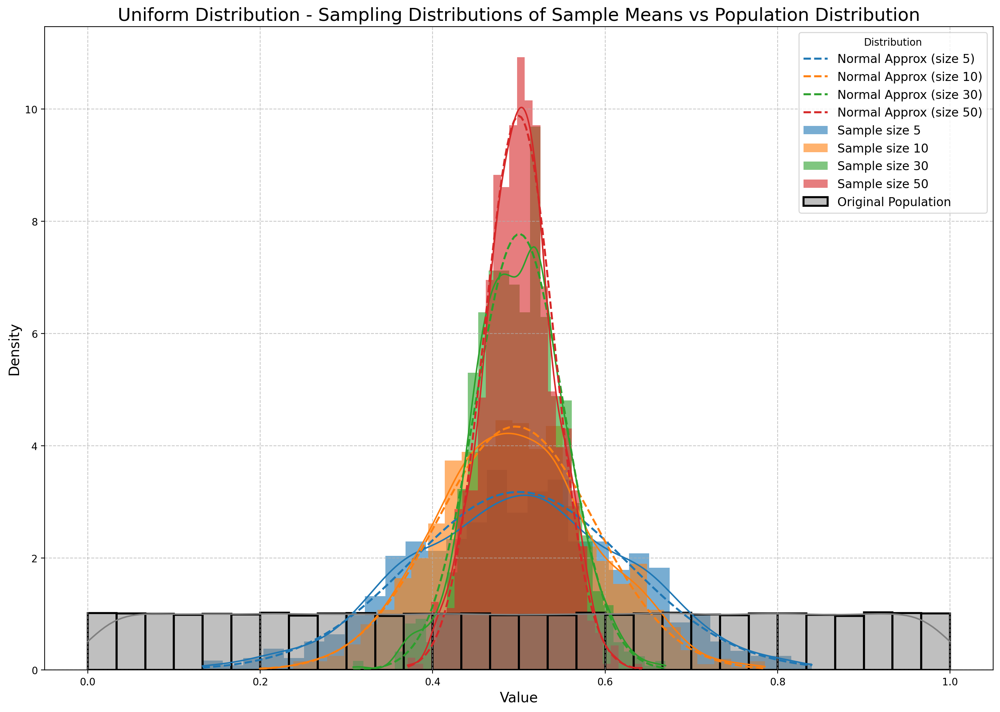

# Problem 1

# Exploring the Central Limit Theorem through Simulations

## Task Overview:

This task involves exploring the Central Limit Theorem (CLT) through simulations with different population distributions. You’ll generate datasets representing different populations, sample from these populations, and analyze the sample means as the sample size increases. By plotting histograms of the sample means, we can observe the convergence to a normal distribution and discuss the implications of these results.

## Plan:

We’ll proceed with the following steps:

1. **Simulating Sampling Distributions** using several population distributions (Uniform, Exponential, and Binomial).
2. **Sampling and Visualization**: Sampling data from the population and visualizing the sample mean distributions.
3. **Parameter Exploration**: Investigating how sample size and population shape influence convergence to normality.
4. **Practical Applications**: Discussing the real-world implications of the Central Limit Theorem.

## 1. Simulating Sampling Distributions:

We'll start by generating large datasets for each population distribution. We’ll use Python’s `numpy` to generate these distributions and the `matplotlib` and `seaborn` libraries for visualization.

### Population Distributions:

- **Uniform Distribution**: Random values between a range (e.g., 0 and 1).
- **Exponential Distribution**: Values from an exponential distribution with a given rate.
- **Binomial Distribution**: Values representing the number of successes in a fixed number of trials with a certain probability.

## 2. Sampling and Visualization:

For each distribution, we will:

- Randomly sample data for different sample sizes (5, 10, 30, 50).
- Calculate the sample means.
- Repeat the sampling process to create the sampling distribution of the sample mean.
- Plot the histograms of the sample means to observe the convergence toward normality.

## 3. Code Implementation:

```python

import numpy as np
import matplotlib.pyplot as plt
import seaborn as sns
from scipy.stats import skew, kurtosis
import scipy.stats as stats

# Function to generate sample means
def sample_means(population, sample_size, num_samples):
    means = []
    for _ in range(num_samples):
        sample = np.random.choice(population, sample_size)
        means.append(np.mean(sample))
    return means

# Function to plot histograms of sample means with theoretical normal distribution overlay
def plot_histogram(data_dict, population, title):
    plt.figure(figsize=(14, 10), dpi=200)  # Increased figure size and high DPI for better resolution
    for size, data in data_dict.items():
        sns.histplot(data, kde=True, label=f'Sample size {size}', stat="density", linewidth=0, bins=30, alpha=0.6)

        # Overlay a normal distribution with the same mean and standard deviation
        mean = np.mean(data)
        std = np.std(data)
        x = np.linspace(min(data), max(data), 100)
        plt.plot(x, stats.norm.pdf(x, mean, std), label=f'Normal Approx (size {size})', linestyle='--', linewidth=2)

    # Original population distribution plot
    sns.histplot(population, kde=True, label='Original Population', color='gray', stat="density", linewidth=2, bins=30)

    # Title, axis labels, and formatting improvements
    plt.title(f'{title} - Sampling Distributions of Sample Means vs Population Distribution', fontsize=18)
    plt.xlabel('Value', fontsize=14)
    plt.ylabel('Density', fontsize=14)
    plt.legend(title='Distribution', loc='best', fontsize=12)
    plt.grid(True, linestyle='--', alpha=0.7)
    plt.tight_layout()  # Adjust layout to avoid overlapping elements
    plt.show()

# Function to calculate sample variance and standard error
def sample_variance(data_dict):
    variance = {size: np.var(data) for size, data in data_dict.items()}
    std_error = {size: np.std(data) / np.sqrt(size) for size, data in data_dict.items()}
    return variance, std_error

# Function to calculate skewness and kurtosis
def skewness_kurtosis(data_dict):
    skewness = {size: skew(data) for size, data in data_dict.items()}
    kurt = {size: kurtosis(data) for size, data in data_dict.items()}
    return skewness, kurt

# Population size
population_size = 100000

# Generating populations
uniform_population = np.random.uniform(0, 1, population_size)  # Uniform distribution
exponential_population = np.random.exponential(1, population_size)  # Exponential distribution
binomial_population = np.random.binomial(n=100, p=0.5, size=population_size)  # Binomial distribution

# Sample sizes to test
sample_sizes = [5, 10, 30, 50]
num_samples = 1000  # Number of samples to draw

# Generating sample means for different sample sizes and distributions
uniform_means = {size: sample_means(uniform_population, size, num_samples) for size in sample_sizes}
exponential_means = {size: sample_means(exponential_population, size, num_samples) for size in sample_sizes}
binomial_means = {size: sample_means(binomial_population, size, num_samples) for size in sample_sizes}

# Plotting histograms for each distribution and comparing with population
plot_histogram(uniform_means, uniform_population, 'Uniform Distribution')
plot_histogram(exponential_means, exponential_population, 'Exponential Distribution')
plot_histogram(binomial_means, binomial_population, 'Binomial Distribution')

# Calculating variance, standard error, skewness, and kurtosis
uniform_variance, uniform_se = sample_variance(uniform_means)
exponential_variance, exponential_se = sample_variance(exponential_means)
binomial_variance, binomial_se = sample_variance(binomial_means)

uniform_skewness, uniform_kurt = skewness_kurtosis(uniform_means)
exponential_skewness, exponential_kurt = skewness_kurtosis(exponential_means)
binomial_skewness, binomial_kurt = skewness_kurtosis(binomial_means)

# Printing results
print("Uniform variance by sample size:", uniform_variance)
print("Exponential variance by sample size:", exponential_variance)
print("Binomial variance by sample size:", binomial_variance)

print("\nUniform standard error by sample size:", uniform_se)
print("Exponential standard error by sample size:", exponential_se)
print("Binomial standard error by sample size:", binomial_se)

print("\nUniform skewness by sample size:", uniform_skewness)
print("Exponential skewness by sample size:", exponential_skewness)
print("Binomial skewness by sample size:", binomial_skewness)

print("\nUniform kurtosis by sample size:", uniform_kurt)
print("Exponential kurtosis by sample size:", exponential_kurt)
print("Binomial kurtosis by sample size:", binomial_kurt)


```




