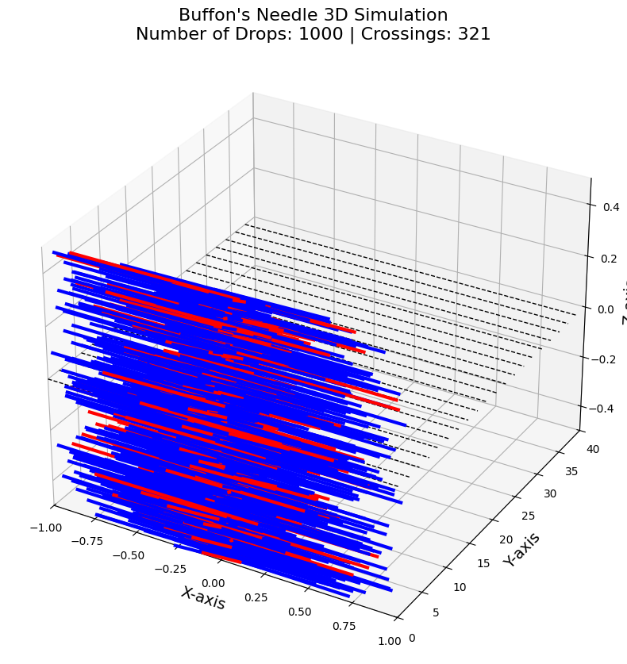

# Problem 2

# Estimating Pi Using Monte Carlo Methods

## Motivation

Monte Carlo simulations are a powerful computational technique that use randomness to solve problems or estimate values. One elegant application of Monte Carlo methods is estimating the value of \(\pi\) using geometric probability. By randomly generating points and analyzing their positions relative to a geometric shape, we can approximate \(\pi\) in an intuitive and visually engaging way.

This method connects fundamental concepts in probability, geometry, and numerical computation. The Monte Carlo approach for estimating \(\pi\) highlights the versatility and simplicity of randomness while offering insights into convergence rates and computational efficiency.

---

## Part 1: Estimating \(\pi\) Using a Circle

### 1. Theoretical Foundation

The idea behind using the circle-based Monte Carlo method to estimate \(\pi\) relies on the ratio of points inside a circle to the total number of points in a square. Consider a unit circle inscribed inside a square. The unit circle is centered at the origin with the equation:

$$
x^2 + y^2 \leq 1
$$

This circle is inscribed within a square of side length 2. If we randomly generate points \((x, y)\) within the square (with \(x, y \in [-1, 1]\)), we can check whether each point lies inside the circle using the equation above.

The ratio of the area of the circle to the area of the square is:

$$
\frac{A_{\text{circle}}}{A_{\text{square}}} = \frac{\pi}{4}
$$

Thus, the ratio of points inside the circle to the total number of points will approximate the ratio of the areas, allowing us to estimate \(\pi\). Specifically:

$$
\pi \approx 4 \times \frac{\text{Number of points inside the circle}}{\text{Total number of points}}
$$

### 2. Simulation

We'll simulate the process by generating random points in the square and counting how many fall inside the unit circle.

#### Python Code for Circle-Based Monte Carlo Method:

```python

import numpy as np
import matplotlib.pyplot as plt

def estimate_pi_advanced(num_points):
    # Generate random points in a 2D space [-1, 1] x [-1, 1]
    x = np.random.uniform(-1, 1, num_points)
    y = np.random.uniform(-1, 1, num_points)

    # Calculate the number of points inside the unit circle
    inside_circle = np.sum(x**2 + y**2 <= 1)

    # Estimate Pi
    pi_estimate = 4 * inside_circle / num_points

    # Plotting
    plt.figure(figsize=(6, 6))
    plt.scatter(x, y, color='blue', s=1, alpha=0.5, label="Points")
    plt.scatter(x[x**2 + y**2 <= 1], y[x**2 + y**2 <= 1], color='green', s=1, label="Inside Circle")
    plt.scatter(x[x**2 + y**2 > 1], y[x**2 + y**2 > 1], color='red', s=1, label="Outside Circle")
    plt.title(f"Monte Carlo Estimation of Pi: {pi_estimate}")
    plt.gca().set_aspect('equal', adjustable='box')
    plt.legend()
    plt.show()

    return pi_estimate

# Running the simulation with a larger number of points
num_points = 100000
pi_estimate = estimate_pi_advanced(num_points)
print(f"Estimated Pi: {pi_estimate}")

```


# Task 2: Estimating Pi using Buffon’s Needle

## Introduction

In this task, we will estimate the value of \(\pi\) using a famous problem known as **Buffon’s Needle**. This problem relies on the geometric probability of a needle randomly dropped on a plane with parallel lines. By calculating the probability of the needle crossing one of these lines, we can estimate the value of \(\pi\).

Buffon’s Needle is one of the early applications of **Monte Carlo methods** that uses random sampling to solve problems, and it connects geometric probability to numerical computation.

## 1. Theoretical Foundation

### 1.1 Buffon’s Needle Problem

In Buffon’s Needle problem, a needle of length \(L\) is dropped on a plane with parallel lines spaced at a distance \(D\). The question is: what is the probability that the needle crosses one of the lines?

By using probability theory, this problem leads to the following formula for estimating \(\pi\):

$$
P(\text{crossing}) = \frac{2L}{\pi D}
$$

From this, we can estimate \(\pi\) using the formula:

$$
\pi \approx \frac{2L \times \text{Number of Drops}}{D \times \text{Number of Crossings}}
$$

Where:

- \(L\) is the length of the needle,
- \(D\) is the distance between the parallel lines,
- The **crossings** are the number of times the needle crosses a line during the drop.

## 2. Simulation

### 2.1 Buffon’s Needle Simulation

We simulate the random dropping of needles on a plane with parallel lines. We randomly generate the **angle** of the needle and the **distance** from the center of the needle to the nearest line. If the distance from the center is less than or equal to the half-length of the needle projected in the direction of the angle, the needle crosses the line.

The estimate of \(\pi\) is calculated as the ratio of the total number of drops to the number of crossings.

### 2.2 Python Code for Simulation

Below is the Python code that implements the **Buffon’s Needle** simulation:

```python

import numpy as np
import matplotlib.pyplot as plt
from mpl_toolkits.mplot3d import Axes3D

def visualize_buffon_3d(num_drops, needle_length=1, line_distance=2):
    # Create a 3D plot to visualize the simulation
    fig = plt.figure(figsize=(12, 10))
    ax = fig.add_subplot(111, projection='3d')

    # Draw parallel lines on the xy-plane
    num_lines = 20  # Number of lines on the plane
    for i in range(num_lines):
        ax.plot([-needle_length, needle_length], [i * line_distance, i * line_distance], [0, 0], color='black', lw=1, linestyle='--')

    # Track the number of crossings
    crossings = 0

    # Generate the needles
    for _ in range(num_drops):
        # Randomly generate the angle (theta) and the distance from the center of the needle to the nearest line
        angle = np.random.uniform(0, np.pi / 2)
        distance = np.random.uniform(0, line_distance / 2)

        # Randomly assign z-axis position for 3D simulation
        z_position = np.random.uniform(-0.5, 0.5)

        # Calculate the needle's half-length projection along the x-axis
        needle_half_length = (needle_length / 2) * np.cos(angle)

        # Randomly position the needle center (distance from the line and the angle of rotation)
        center_x = np.random.uniform(-needle_half_length, needle_half_length)
        center_y = np.random.uniform(0, line_distance)

        # Calculate the coordinates of the needle's ends in 3D
        x1 = center_x - needle_half_length * np.cos(angle)
        y1 = center_y - needle_half_length * np.sin(angle)
        z1 = z_position

        x2 = center_x + needle_half_length * np.cos(angle)
        y2 = center_y + needle_half_length * np.sin(angle)
        z2 = z_position

        # Check if the needle crosses the line
        if distance <= (needle_length / 2) * np.sin(angle):
            crossings += 1
            color = 'red'  # Crossed line, red color
        else:
            color = 'blue'  # Did not cross line, blue color

        # Plot the needle in 3D space
        ax.plot([x1, x2], [y1, y2], [z1, z2], color=color, lw=3)

    # Set plot labels and title
    ax.set_title(f"Buffon's Needle 3D Simulation\nNumber of Drops: {num_drops} | Crossings: {crossings}", fontsize=16)
    ax.set_xlabel('X-axis', fontsize=14)
    ax.set_ylabel('Y-axis', fontsize=14)
    ax.set_zlabel('Z-axis', fontsize=14)

    # Set the limits for the axes
    ax.set_xlim([-needle_length, needle_length])
    ax.set_ylim([0, num_lines * line_distance])
    ax.set_zlim([-0.5, 0.5])

    # Show the plot
    plt.show()

def estimate_pi_buffon_3d(num_drops, needle_length=1, line_distance=2):
    crossings = 0
    for _ in range(num_drops):
        # Randomly generate the angle (theta) and the distance from the center of the needle to the nearest line
        angle = np.random.uniform(0, np.pi / 2)
        distance = np.random.uniform(0, line_distance / 2)

        # Check if the needle crosses the line
        if distance <= (needle_length / 2) * np.sin(angle):
            crossings += 1

    # Estimate Pi using the formula
    pi_estimate = (2 * needle_length * num_drops) / (line_distance * crossings)

    return pi_estimate

# Run the simulation
num_drops = 1000  # Number of needle drops for the simulation
estimated_pi_buffon = estimate_pi_buffon_3d(num_drops)

# Print estimated Pi
print(f"Estimated Pi using Buffon's Needle with {num_drops} drops: {estimated_pi_buffon}")

# Visualize the 3D simulation
visualize_buffon_3d(num_drops)

```


